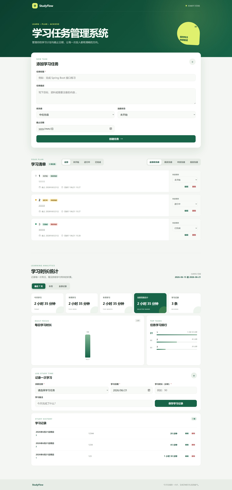

# StudyFlow 学习任务管理系统

StudyFlow 是一个面向个人学习计划管理的全栈练习项目。它将任务规划、状态跟踪、优先级管理与学习时长记录集中在一个简洁的工作台中，并通过统计卡片、每日柱状图和任务排行帮助使用者了解自己的学习投入。

项目采用前后端分离架构，不包含登录功能。后端提供 REST API 并使用 MySQL 持久化数据，前端通过原生 Fetch API 调用后端。

## 在线演示

* 在线前端：https://studyflow-30f.pages.dev
* 后端健康检查：https://studyflow-production-1820.up.railway.app/api/health
* 说明：公开演示环境为只读模式，数据仅供浏览。


## 核心功能

- 学习任务新增、查询、编辑和删除
- 按任务状态筛选：未开始、进行中、已完成
- 任务状态快速更新
- 高、中、低三级任务优先级与优先级筛选
- 学习记录新增、查询、编辑和删除
- 学习记录按任务及日期范围筛选
- 最近 7 天、本月和全部记录统计
- 今日、本周、本月及当前范围学习时长汇总
- 纯 CSS 每日学习时长柱状图
- 按学习分钟数排序的任务排行
- 删除任务时同步删除关联学习记录
- 统一的参数校验与 JSON 异常响应

## 技术栈

| 层级 | 技术 |
| --- | --- |
| 前端 | Vue 3、Vite、JavaScript、原生 Fetch API、CSS |
| 后端 | Java 21、Spring Boot 3、Spring Web、Spring Data JPA、Validation |
| 数据库 | MySQL 8、MySQL Connector/J |
| 测试 | JUnit 5、Mockito、MockMvc |
| 构建 | Maven Wrapper、npm |

## 项目目录

```text
study-task/
├─ .github/workflows/       # GitHub Actions 持续集成
├─ docs/                    # 架构与截图说明
├─ frontend/                # Vue 3 前端项目
│  ├─ src/components/       # 页面组件
│  ├─ src/services/         # 后端 API 请求模块
│  ├─ package.json
│  └─ vite.config.js
├─ src/main/java/com/example/studytask/
│  ├─ controller/           # REST API 控制器
│  ├─ dto/                  # 请求与响应 DTO
│  ├─ entity/               # JPA 实体与枚举
│  ├─ exception/            # 统一异常处理
│  ├─ repository/           # 数据访问层
│  └─ service/              # 业务逻辑层
├─ src/main/resources/      # Spring Boot 通用及本地示例配置
├─ src/test/                # 后端自动化测试
├─ pom.xml
└─ README.md
```

## 系统架构

浏览器访问 Vue 3 单页应用，前端通过 HTTP/JSON 请求 Spring Boot REST API；后端在 Service 层处理任务、学习记录与统计逻辑，并通过 Spring Data JPA 访问 MySQL。

```text
Vue 3 + Vite（localhost:5173）
              │ HTTP / JSON
              ▼
Spring Boot REST API（localhost:8080）
              │ JPA / JDBC
              ▼
        MySQL 8（study_task）
```

更详细的模块关系见 [系统架构文档](docs/architecture.md)。

## 本地环境要求

- Java 21
- Node.js 20.19+ 或 22.12+
- npm
- MySQL 8

## 本地运行

### 1. 创建数据库

在 MySQL Workbench 或 MySQL 命令行中执行：

```sql
CREATE DATABASE study_task
    CHARACTER SET utf8mb4
    COLLATE utf8mb4_unicode_ci;
```

JPA 会在后端首次启动时自动创建或增量维护数据表，不需要手动创建 `tasks` 或 `study_records` 表。

### 2. 配置本地数据库连接

复制安全示例文件：

```powershell
Copy-Item src/main/resources/application-local.example.properties `
  src/main/resources/application-local.properties
```

打开本机的 `application-local.properties`，仅将下面的占位符替换为自己的 MySQL 密码：

```properties
spring.datasource.password=YOUR_MYSQL_PASSWORD
```

`application-local.properties` 已被 Git 忽略，请勿提交真实密码。示例文件只保留占位符，可以安全提交。

### 3. 启动后端

Windows PowerShell：

```powershell
.\mvnw.cmd spring-boot:run "-Dspring-boot.run.profiles=local"
```

macOS / Linux：

```bash
./mvnw spring-boot:run -Dspring-boot.run.profiles=local
```

后端默认地址：`http://localhost:8080`。

前端未设置 `VITE_API_BASE_URL` 时，也会默认请求 `http://localhost:8080`。

### 4. 启动前端

打开另一个终端：

```bash
cd frontend
npm ci
npm run dev
```

前端默认地址：`http://localhost:5173`。

## REST API

### 学习任务 `/api/tasks`

| 方法 | 路径 | 说明 |
| --- | --- | --- |
| POST | `/api/tasks` | 创建任务 |
| GET | `/api/tasks` | 查询任务列表，可选 `status`、`priority` |
| GET | `/api/tasks/{id}` | 查询任务详情 |
| PUT | `/api/tasks/{id}` | 完整更新任务 |
| PATCH | `/api/tasks/{id}/status` | 快速更新任务状态 |
| DELETE | `/api/tasks/{id}` | 删除任务及其学习记录 |

### 学习记录 `/api/study-records`

| 方法 | 路径 | 说明 |
| --- | --- | --- |
| POST | `/api/study-records` | 创建学习记录 |
| GET | `/api/study-records` | 查询记录，可选 `taskId`、`startDate`、`endDate` |
| PUT | `/api/study-records/{id}` | 更新学习记录 |
| DELETE | `/api/study-records/{id}` | 删除学习记录 |

### 统计 `/api/statistics`

| 方法 | 路径 | 说明 |
| --- | --- | --- |
| GET | `/api/statistics/dashboard` | 获取统计面板，可选 `startDate`、`endDate`，默认最近 7 天 |

### 健康检查

| 方法 | 路径 | 说明 |
| --- | --- | --- |
| GET | `/api/health` | 返回 `{"status":"ok"}`，供 Railway 健康检查使用 |

接口参数错误会返回统一 JSON，包含 `timestamp`、`status`、`message` 和 `path`。

## 在线部署

推荐按以下顺序部署：

1. 创建 Railway MySQL。
2. 部署 Railway Spring Boot 后端并取得后端公开地址。
3. 在 Railway 配置 `APP_CORS_ALLOWED_ORIGIN`；首次可填写预期的 Pages 地址，之后再以实际地址校正。
4. 部署 Cloudflare Pages 前端，并把 Railway 后端地址填入 `VITE_API_BASE_URL`。
5. 将 Cloudflare Pages 的实际生产域名回填到 Railway 的 `APP_CORS_ALLOWED_ORIGIN`。
6. 分别重新部署后端和前端，检查健康接口、页面加载和浏览器 Network 请求。

### 1. Railway MySQL

1. 登录 Railway，点击 **New Project** 或创建一个 **Empty project**。
2. 在项目画布点击 **+ New / Create**，选择 **Database → Add MySQL**。
3. 等待 MySQL 服务启动。不要把数据库变量复制到代码、README 或 Git。
4. 后续在后端服务的 **Variables** 中使用 **Add Reference** 引用 MySQL 服务提供的变量。

### 2. Railway Spring Boot 后端

当前后端位于仓库根目录，使用 Railway 的 Java/Railpack 构建即可，不需要新增 Dockerfile。

1. 在 Railway 项目画布点击 **+ New → GitHub Repo**，选择 StudyFlow 仓库。
2. 打开创建出的后端 Service，进入 **Settings**。
3. Root Directory 保持仓库根目录 `/`。
4. 在 **Build** 中设置 Build Command：

   ```bash
   ./mvnw -DskipTests package
   ```

5. 在 **Deploy** 中设置 Start Command：

   ```bash
   java -jar target/study-task-0.0.1-SNAPSHOT.jar
   ```

6. 在 **Variables** 中添加生产变量。MySQL 变量建议使用 Railway 的引用变量功能关联刚创建的 MySQL 服务。
7. 在 **Settings / Healthcheck** 中将 Healthcheck Path 设置为：

   ```text
   /api/health
   ```

8. 点击 **Deploy / Redeploy**，在部署日志中确认应用启动。
9. 进入 **Settings → Networking**，点击 **Generate Domain** 获得后端公开 HTTPS 地址。
10. 在浏览器访问 `https://<你的Railway后端域名>/api/health`，应返回 `{"status":"ok"}`。

Railway 当前支持从 GitHub 自动识别 Java 项目、配置自定义构建与启动命令，并在 Networking 中生成公开域名。可参考 [Railway Spring Boot 官方指南](https://docs.railway.com/guides/spring-boot) 和 [Railway 构建配置](https://docs.railway.com/guides/build-configuration)。

#### Railway 后端变量

| 变量 | 填写说明 |
| --- | --- |
| `SPRING_PROFILES_ACTIVE` | `prod` |
| `PORT` | Railway 自动注入，不建议手动填写 |
| `MYSQLHOST` | 引用 Railway MySQL 的 `MYSQLHOST` |
| `MYSQLPORT` | 引用 Railway MySQL 的 `MYSQLPORT` |
| `MYSQLDATABASE` | 引用 Railway MySQL 的 `MYSQLDATABASE` |
| `MYSQLUSER` | 引用 Railway MySQL 的 `MYSQLUSER` |
| `MYSQLPASSWORD` | 引用 Railway MySQL 的 `MYSQLPASSWORD`，不要写入 Git |
| `APP_CORS_ALLOWED_ORIGIN` | Cloudflare Pages 实际生产 Origin，例如 `https://studyflow.pages.dev`，不要带路径 |
| `APP_DEMO_READ_ONLY` | 公开只读演示填写 `true`；需要在线编辑时填写 `false` |

生产配置位于 `application-prod.properties`，监听 Railway 注入的 `PORT`，并通过上述变量连接 MySQL。生产环境关闭 SQL 输出。

当 `APP_DEMO_READ_ONLY=true` 时，所有 `/api/**` 下的 `POST`、`PUT`、`PATCH`、`DELETE` 请求返回 `403` 和稳定错误码 `DEMO_READ_ONLY`；GET 与 OPTIONS 保持可用。本地默认值为 `false`。

### 3. Cloudflare Pages 前端

1. 登录 Cloudflare，进入 **Workers & Pages**。
2. 点击 **Create application → Pages → Connect to Git**。
3. 授权并选择 StudyFlow GitHub 仓库，然后点击 **Begin setup**。
4. 选择生产分支 `main`。
5. 在构建设置中填写：

   | 字段 | 值 |
   | --- | --- |
   | Framework preset | Vue 或 Vite |
   | Root directory (advanced) | `frontend` |
   | Build command | `npm run build` |
   | Build output directory | `dist` |

6. 在 **Environment variables** 添加：

   ```text
   VITE_API_BASE_URL=https://<你的Railway后端域名>
   ```

   这里只填写 Origin，不要附加 `/api`，也不要提交真实 `.env` 文件。

7. 点击 **Save and Deploy**。
8. 首次部署后复制实际 `https://<项目名>.pages.dev` 地址。
9. 回到 Railway 后端 Service 的 **Variables**，把该地址填写到 `APP_CORS_ALLOWED_ORIGIN`，然后 Redeploy 后端。
10. 如果修改过 `VITE_API_BASE_URL`，在 Cloudflare Pages 的 **Settings → Environment variables** 保存后重新部署前端。

Cloudflare Pages 的 Git 集成支持设置 monorepo Root directory、构建命令、输出目录和构建环境变量。可参考 [Cloudflare Pages Git 集成](https://developers.cloudflare.com/pages/get-started/git-integration/) 与 [构建配置](https://developers.cloudflare.com/pages/configuration/build-configuration/)。

前端仓库提供安全示例 `frontend/.env.example`：

```properties
VITE_API_BASE_URL=http://localhost:8080
```

本地可以复制为 `.env.local` 后修改，但 `.env`、`.env.local`、`.env.production` 都已被 Git 忽略，禁止提交真实部署地址或其他敏感变量。

## 测试与构建

运行后端测试：

```powershell
.\mvnw.cmd test
```

macOS / Linux 使用：

```bash
./mvnw test
```

运行前端生产构建：

```bash
cd frontend
npm ci
npm run build
```

项目的 GitHub Actions 会在推送到 `main` 或创建 Pull Request 时自动执行后端测试和前端构建。测试使用 Mockito 与 MockMvc，不依赖本地 MySQL 或任何数据库密码。

## 页面截图

### 系统页面总览



## 后续计划

- 使用 Docker Compose 简化前后端与数据库部署
- 增加登录鉴权与用户数据隔离
- 增加任务搜索与分页
- 增加任务截止日期提醒
