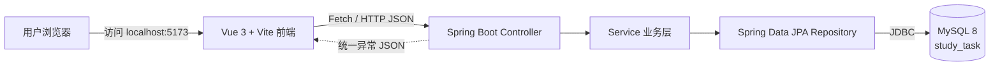
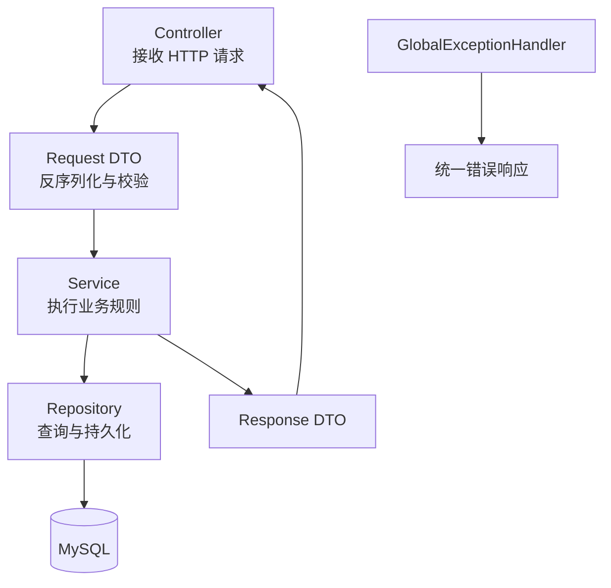
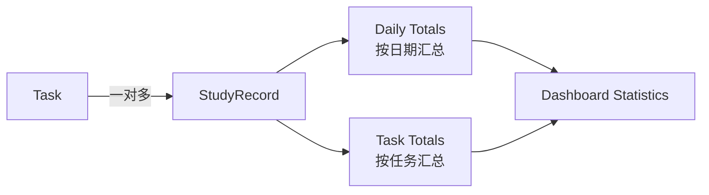

# StudyFlow 系统架构

## 总体结构

StudyFlow 采用前后端分离架构。Vue 3 前端负责界面展示、交互状态和数据格式化；Spring Boot 后端负责参数校验、业务规则、统计汇总和 REST API；MySQL 负责持久化学习任务与学习记录。

前端与后端在本地开发时分别运行于 `5173` 和 `8080` 端口。后端允许来自 `http://localhost:5173` 的跨域请求。

## 后端分层

Controller 不直接访问 Repository，JPA Entity 也不会直接作为接口响应暴露给前端。

## 核心模块

### Task 任务模块

`Task` 表示一项学习任务，包含标题、描述、状态、优先级、截止日期和创建更新时间。状态支持 `NOT_STARTED`、`IN_PROGRESS`、`COMPLETED`，优先级支持 `HIGH`、`MEDIUM`、`LOW`。

主要路径：

- `POST /api/tasks`
- `GET /api/tasks`
- `GET /api/tasks/{id}`
- `PUT /api/tasks/{id}`
- `PATCH /api/tasks/{id}/status`
- `DELETE /api/tasks/{id}`

### StudyRecord 学习记录模块

`StudyRecord` 表示一次实际学习投入，通过必填外键关联 `Task`，记录学习日期、分钟数和可选备注。记录查询支持任务与日期范围筛选，默认按学习日期和 ID 倒序排列。

主要路径：

- `POST /api/study-records`
- `GET /api/study-records`
- `PUT /api/study-records/{id}`
- `DELETE /api/study-records/{id}`

删除任务时，Service 会先删除该任务关联的全部学习记录，再删除任务，从而避免外键异常并保证数据一致性。

### Dashboard Statistics 统计模块

统计模块读取指定日期范围内的学习记录，在 Service 层完成以下聚合：

- 今天、本周、本月学习分钟数
- 当前范围总分钟数和记录数量
- 按日期汇总的每日学习时长
- 按任务汇总并降序排列的学习时长排行

主要路径：

- `GET /api/statistics/dashboard`
- 可选参数：`startDate`、`endDate`
- 未传日期时默认统计最近 7 天

## 数据与安全边界

- 本地数据库凭据仅保存在被 Git 忽略的 `application-local.properties`。
- 仓库只提供使用密码占位符的 `application-local.example.properties`。
- 自动化测试使用 Mockito 和 MockMvc，不访问开发者本地 MySQL。
- 前端不保存数据库凭据，只通过公开的 REST API 与后端通信。
